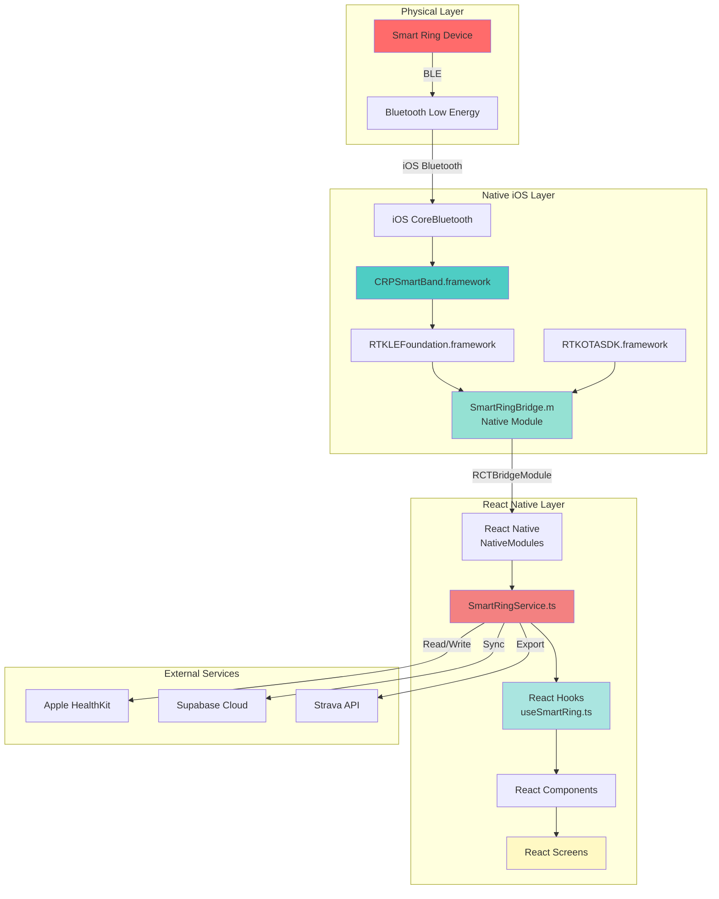
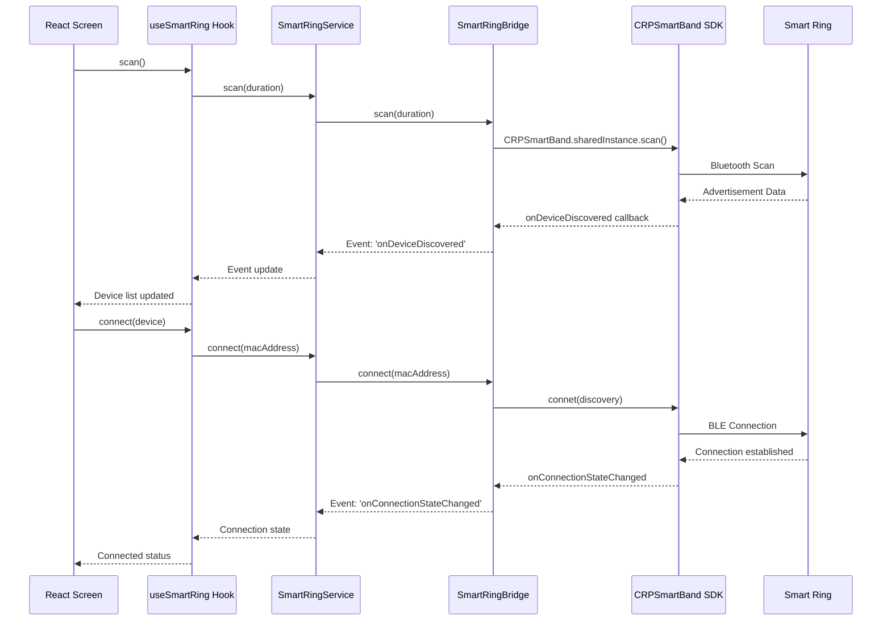
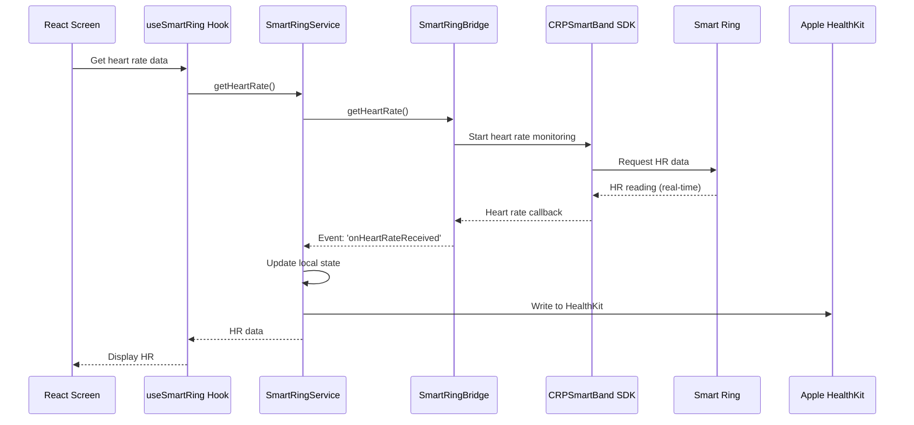
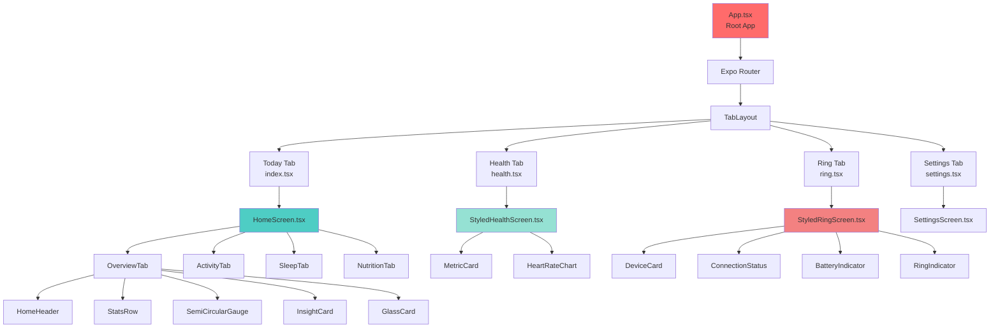
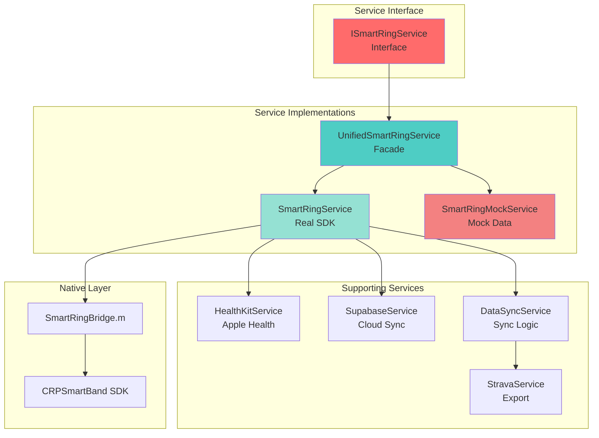
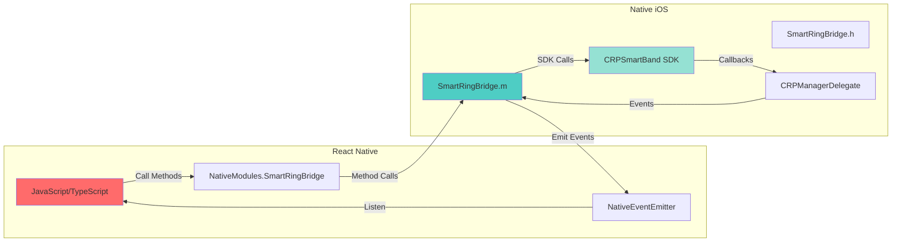

# Smart Ring iOS SDK 3.18.1 - Architecture Documentation

## Table of Contents
1. [Overview](#overview)
2. [Project Structure](#project-structure)
3. [System Architecture](#system-architecture)
4. [Data Flow](#data-flow)
5. [Component Hierarchy](#component-hierarchy)
6. [Service Layer](#service-layer)
7. [Native Bridge](#native-bridge)
8. [Technology Stack](#technology-stack)

---

## Overview

This project is a comprehensive **iOS SDK integration** for a Smart Ring device, combining:

- **Native iOS SDK** (CRPSmartBand.framework) - Vendor-provided SDK for device communication
- **React Native/Expo App** - Modern cross-platform UI built with React Native
- **Native Bridge** - Objective-C bridge connecting SDK to React Native

The architecture follows a **hybrid approach** where the native SDK handles low-level Bluetooth communication, and React Native provides a modern, reactive UI layer.

---

## Project Structure

```
IOS-SDK-3.18.1/
│
├── Framework/                          # Original SDK framework files (zip)
│   ├── CRPSmartBand.framework.zip     # Main SDK
│   ├── RTKLEFoundation.framework.zip  # BLE communication layer
│   ├── RTKOTASDK.framework.zip        # OTA update framework
│   ├── OTAFramework.framework.zip     # Additional OTA support
│   ├── SpeexKit.framework.zip         # Audio processing
│   └── libopus.a                      # Opus codec library
│
├── OC-SDKDemo/                        # Objective-C Demo App
│   ├── CRPSmartBand.framework/        # Extracted framework
│   ├── RTKLEFoundation.framework/     # BLE framework
│   ├── RTKOTASDK.framework/           # OTA framework
│   ├── OTAFramework.framework/        # OTA framework
│   ├── SpeexKit.framework/            # Audio framework
│   └── OC-SDKDemo/                    # Demo app source code
│       ├── ViewController.m           # Main demo view controller
│       └── SetViewController.m        # Settings view controller
│
├── swift-SdkDemo/                     # Swift Demo App
│   └── TestSdk/                       # Swift demo source code
│       ├── ViewController.swift       # Main demo view controller
│       └── SetViewController.swift    # Settings view controller
│
└── SmartRingExpoApp/                  # React Native/Expo App
    ├── app/                           # Expo Router pages
    │   └── (tabs)/                    # Tab navigation
    │       ├── index.tsx              # Today/Home tab
    │       ├── health.tsx             # Health metrics tab
    │       ├── ring.tsx               # Ring device tab
    │       └── settings.tsx           # Settings tab
    │
    ├── src/
    │   ├── components/                # Reusable UI components
    │   │   ├── MetricCard.tsx         # Metric display card
    │   │   ├── RingIndicator.tsx      # Circular progress indicator
    │   │   ├── HeartRateChart.tsx     # Heart rate chart
    │   │   ├── BatteryIndicator.tsx   # Battery display
    │   │   ├── ConnectionStatus.tsx   # Connection status UI
    │   │   ├── DeviceCard.tsx         # Device info card
    │   │   └── home/                  # Home-specific components
    │   │       ├── AnimatedGradientBackground.tsx
    │   │       ├── GlassCard.tsx      # Glassmorphism card
    │   │       ├── HomeHeader.tsx     # Home screen header
    │   │       ├── InsightCard.tsx    # Health insights
    │   │       ├── SemiCircularGauge.tsx
    │   │       ├── SleepStagesChart.tsx
    │   │       └── StatsRow.tsx
    │   │
    │   ├── screens/                   # Full-screen views
    │   │   ├── HomeScreen.tsx         # Main dashboard
    │   │   ├── HealthScreen.tsx       # Health metrics
    │   │   ├── DevicesScreen.tsx      # Device management
    │   │   ├── SettingsScreen.tsx     # App settings
    │   │   ├── StyledRingScreen.tsx   # Ring connection UI
    │   │   ├── StyledHealthScreen.tsx # Health visualization
    │   │   └── home/                  # Home screen tabs
    │   │       ├── OverviewTab.tsx    # Overview dashboard
    │   │       ├── ActivityTab.tsx    # Activity metrics
    │   │       ├── SleepTab.tsx       # Sleep analysis
    │   │       └── NutritionTab.tsx   # Nutrition data
    │   │
    │   ├── services/                  # Business logic layer
    │   │   ├── SmartRingService.ts    # Main SDK service (real)
    │   │   ├── SmartRingMockService.ts # Mock service (testing)
    │   │   ├── UnifiedSmartRingService.ts # Unified interface
    │   │   ├── HealthKitService.ts    # Apple Health integration
    │   │   ├── SupabaseService.ts     # Cloud backend
    │   │   ├── DataSyncService.ts     # Data synchronization
    │   │   └── StravaService.ts       # Strava integration
    │   │
    │   ├── hooks/                     # React hooks
    │   │   ├── useSmartRing.ts        # Smart ring hook
    │   │   ├── useHealthData.ts       # Health data hook
    │   │   ├── useHealthKit.ts        # HealthKit hook
    │   │   ├── useHomeData.ts         # Home data hook
    │   │   └── useAuth.ts             # Authentication hook
    │   │
    │   ├── types/                     # TypeScript definitions
    │   │   ├── sdk.types.ts           # SDK type definitions
    │   │   ├── strava.types.ts        # Strava types
    │   │   ├── supabase.types.ts      # Supabase types
    │   │   └── env.d.ts               # Environment types
    │   │
    │   └── theme/                     # Styling/theming
    │       ├── colors.ts              # Color palette
    │       └── gradients.ts           # Gradient definitions
    │
    └── ios/                           # Native iOS code
        ├── SmartRing/                 # Native module
        │   ├── SmartRingBridge.h      # Bridge header
        │   ├── SmartRingBridge.m      # Bridge implementation
        │   ├── SmartRing-Bridging-Header.h
        │   └── AppDelegate.swift      # App delegate
        │
        ├── Frameworks/                # SDK frameworks
        │   ├── CRPSmartBand.framework/
        │   ├── RTKLEFoundation.framework/
        │   ├── RTKOTASDK.framework/
        │   ├── OTAFramework.framework/
        │   └── SpeexKit.framework/
        │
        └── Podfile                    # CocoaPods dependencies
```

---

## System Architecture

### High-Level Architecture Diagram



### Layer Breakdown

#### 1. Physical Layer
- **Smart Ring Device**: The hardware device with sensors (HR, SpO2, accelerometer, etc.)
- **Bluetooth Low Energy (BLE)**: Communication protocol between device and phone

#### 2. Native iOS Layer
- **CoreBluetooth**: iOS framework for Bluetooth communication
- **CRPSmartBand.framework**: Main SDK provided by vendor
- **RTKLEFoundation.framework**: Low-level BLE communication abstraction
- **RTKOTASDK.framework**: Over-the-air firmware update capability
- **SmartRingBridge**: Objective-C native module bridging SDK to React Native

#### 3. React Native Layer
- **NativeModules**: React Native's bridge to native code
- **SmartRingService**: TypeScript service wrapping native bridge
- **React Hooks**: Custom hooks for state management
- **Components**: Reusable UI components
- **Screens**: Full-screen views and navigation

#### 4. External Services
- **Apple HealthKit**: iOS health data store
- **Supabase**: Cloud backend for data sync
- **Strava**: Third-party fitness platform integration

---

## Data Flow

### Connection Flow



### iOS BLE Connection Synchronization (Important!)

**Challenge**: iOS maintains Bluetooth Low Energy connections in the background even when the app is terminated. When the app relaunches, the SDK needs 1.5-2 seconds to detect this existing connection.

**Issue**: If the app checks connection status too early (e.g., at 800ms), the SDK returns `false` even though iOS already has an active BLE connection. This causes:
- Duplicate connection attempts to an already-connected device
- "Connection timed out" errors
- UI showing "Reconnect" when actually connected
- Race conditions between multiple auto-reconnect attempts

**Solution (Implemented)**:

1. **Single Auto-Reconnect Source**: Removed duplicate auto-reconnect logic from TabLayout. Only `useHomeData` hook handles auto-reconnection on app launch.

2. **Increased Initial Delay**: Wait 2 seconds before first connection check (increased from 800ms) to give SDK time to sync with iOS BLE state.

3. **Retry Logic**: When `autoReconnect()` fails with timeout error, wait 1s and recheck connection status. Often the SDK just needed more time to sync.

4. **Separated Concerns**:
   - Connection state listener: Only updates UI state, doesn't trigger data fetching
   - Mount effect: Handles initial connection check and data fetch
   - Pull-to-refresh: Handles manual reconnection

**Timing Flow**:
```
App Launch → useHomeData mounts
           ↓
      Wait 2000ms (iOS BLE sync)
           ↓
   Check SDK connection status
           ↓
   Connected? → Fetch data immediately
           ↓
   Not connected? → Auto-reconnect → Wait 500ms → Fetch data
```

**Code Locations**:
- Connection logic: `src/hooks/useHomeData.ts` (lines 626-658)
- Retry logic: `src/hooks/useHomeData.ts` (lines 477-527)
- Route guard only: `app/(tabs)/_layout.tsx` (simplified, no reconnect)

### Data Retrieval Flow



### Real-time Monitoring Flow

```mermaid
graph LR
    A[Device Sensors] -->|Continuous Data| B[SDK Callbacks]
    B -->|Events| C[SmartRingBridge]
    C -->|NativeEventEmitter| D[SmartRingService]
    D -->|React Events| E[useSmartRing Hook]
    E -->|State Update| F[React Components]
    F -->|Re-render| G[UI Update]
    
    style A fill:#ff6b6b
    style B fill:#4ecdc4
    style C fill:#95e1d3
    style D fill:#f38181
    style E fill:#aae5e0
    style F fill:#fff9c4
    style G fill:#c9f5f0
```



---

## Component Hierarchy

### UI Component Tree



---

## Service Layer

### Service Architecture



### Service Responsibilities

#### SmartRingService
- **Purpose**: Main service wrapping native bridge
- **Responsibilities**:
  - Device connection/disconnection
  - Data retrieval (steps, heart rate, sleep, etc.)
  - Real-time monitoring setup
  - Event handling
  - Mock mode fallback

#### SmartRingMockService
- **Purpose**: Mock data for development/testing
- **Responsibilities**:
  - Generate realistic mock data
  - Simulate device behavior
  - Enable testing without physical device

#### UnifiedSmartRingService
- **Purpose**: Facade pattern unifying real and mock services
- **Responsibilities**:
  - Switch between real and mock mode
  - Provide consistent API
  - Handle service selection logic

#### HealthKitService
- **Purpose**: Apple HealthKit integration
- **Responsibilities**:
  - Read health data from HealthKit
  - Write ring data to HealthKit
  - Health data synchronization

#### SupabaseService
- **Purpose**: Cloud backend integration
- **Responsibilities**:
  - User authentication
  - Data persistence
  - Cloud synchronization

#### DataSyncService
- **Purpose**: Data synchronization logic
- **Responsibilities**:
  - Sync ring data to cloud
  - Merge data from multiple sources
  - Conflict resolution

---

## Native Bridge

### Bridge Architecture



### Bridge Methods

#### Connection Methods
- `scan(duration)` - Scan for devices
- `scanAll(duration)` - Unfiltered scan (debug)
- `connect(macAddress)` - Connect to device
- `disconnect()` - Disconnect device
- `reconnect()` - Reconnect to last device

#### Data Retrieval Methods
- `getSteps()` - Get step count
- `getSleepData()` - Get sleep data
- `getBattery()` - Get battery level
- `getVersion()` - Get firmware version
- `get24HourHeartRate()` - Get 24-hour HR history
- `get24HourSteps()` - Get 24-hour step history
- `getProfile()` - Get user profile
- `getSportData()` - Get sport activity data

#### Real-time Monitoring Methods
- `startHeartRateMonitoring()` / `stopHeartRateMonitoring()`
- `startSpO2Monitoring()` / `stopSpO2Monitoring()`
- `startBloodPressureMonitoring()` / `stopBloodPressureMonitoring()`

#### Settings Methods
- `setProfile(profile)` - Update user profile
- `setGoal(steps)` - Set daily step goal
- `setTimeFormat(is24Hour)` - Set time format
- `setUnit(isMetric)` - Set measurement units
- `findDevice()` - Trigger device vibration

### Bridge Events

The bridge emits the following events via `NativeEventEmitter`:

- `onConnectionStateChanged` - Connection state updates
- `onBluetoothStateChanged` - Bluetooth state changes
- `onDeviceDiscovered` - New device found during scan
- `onHeartRateReceived` - Real-time heart rate data
- `onSpO2Received` - SpO2 measurements
- `onBloodPressureReceived` - Blood pressure readings
- `onStepsReceived` - Step updates
- `onBatteryReceived` - Battery level updates
- `onUpgradeProgress` - Firmware upgrade progress
- `onDebugLog` - Debug logging

---

## Technology Stack

### Frontend (React Native)
- **Framework**: Expo ~54.0.0
- **React**: 19.1.0
- **React Native**: 0.81.5
- **Navigation**: Expo Router ~6.0.21
- **UI Libraries**:
  - `react-native-svg` - SVG rendering
  - `react-native-reanimated` - Animations
  - `expo-linear-gradient` - Gradients
- **State Management**: React Hooks
- **TypeScript**: ~5.3.0

### Native iOS
- **Language**: Objective-C (Bridge), Swift (App Delegate)
- **iOS SDK**: CRPSmartBand.framework 3.18.1
- **Bluetooth**: CoreBluetooth framework
- **Dependency Management**: CocoaPods
- **Minimum iOS Version**: 15.0+

### External Integrations
- **Apple HealthKit**: Health data sync
- **Supabase**: Backend as a service
- **Strava API**: Fitness platform integration

### Development Tools
- **Build System**: Xcode, Expo CLI
- **Package Manager**: npm
- **Version Control**: Git

---

## Key Design Patterns

### 1. Bridge Pattern
The native bridge (SmartRingBridge) acts as an adapter between the native SDK and React Native JavaScript layer.

### 2. Facade Pattern
UnifiedSmartRingService provides a simplified interface to the complex subsystem of services.

### 3. Observer Pattern
Real-time data uses event emitters to notify React components of changes.

### 4. Repository Pattern
Service layer abstracts data access, allowing switching between real SDK and mock data.

### 5. Hook Pattern
Custom React hooks encapsulate service logic and state management.

---

## Data Types

### Core Data Types

```typescript
// Device Information
interface DeviceInfo {
  macAddress: string;
  name: string;
  rssi: number;
  isConnected: boolean;
}

// Health Metrics
interface StepsData {
  steps: number;
  distance: number;
  calories: number;
  timestamp: number;
}

interface HeartRateData {
  heartRate: number;
  rrInterval?: number;
  timestamp: number;
}

interface SleepData {
  totalSleep: number;
  deepSleep: number;
  lightSleep: number;
  remSleep: number;
  date: string;
}

// Connection States
type ConnectionState = 'disconnected' | 'connecting' | 'connected' | 'error';
type BluetoothState = 'unknown' | 'poweredOn' | 'poweredOff' | 'unauthorized';
```

---

## Testing Strategy

### Mock Service
- Provides realistic mock data for development
- Allows testing without physical device
- Simulates real-time data streams

### Real SDK Testing
- Requires physical device
- Tests actual Bluetooth communication
- Validates data accuracy

### Integration Testing
- Tests bridge between React Native and native code
- Validates event propagation
- Tests error handling

---

## Deployment

### Development Build
```bash
# Install dependencies
npm install

# Start development server
npx expo start

# Run on iOS
npx expo run:ios
```

### Production Build
1. Build iOS app with Xcode
2. Archive for App Store
3. Submit to App Store Connect

### Requirements
- Physical iOS device for testing (Bluetooth)
- Apple Developer account for distribution
- Xcode for building native modules

---

## Future Enhancements

### Potential Improvements
1. **Android Support**: Create Android bridge if SDK becomes available
2. **Offline Mode**: Local data caching and sync
3. **Analytics**: User behavior tracking
4. **Notifications**: Push notifications for health alerts
5. **Widgets**: iOS home screen widgets
6. **Watch App**: Apple Watch companion app
7. **Machine Learning**: Health insights and predictions

---

## Conclusion

This architecture provides a robust, scalable solution for integrating a native iOS SDK into a React Native application. The separation of concerns allows for:

- **Maintainability**: Clear layer separation
- **Testability**: Mock service for development
- **Extensibility**: Easy to add new features
- **Performance**: Native SDK for optimal Bluetooth communication
- **User Experience**: Modern React Native UI

The bridge pattern enables seamless communication between native iOS code and React Native, while the service layer provides a clean abstraction for business logic.

