# Smart Ring iOS SDK - Visual Architecture Diagrams

This document contains visual diagrams that can be rendered using Mermaid.js (supported in GitHub, GitLab, and many markdown viewers).

---

## 1. Complete System Architecture

```mermaid
graph TB
    subgraph "Physical Layer"
        Ring[📱 Smart Ring Device<br/>Sensors: HR, SpO2, Accelerometer]
        BLE[📡 Bluetooth Low Energy<br/>BLE Communication]
    end

    subgraph "iOS Native Layer"
        CoreBT[iOS CoreBluetooth<br/>Framework]
        CRPSDK[CRPSmartBand.framework<br/>Main SDK]
        RTKLE[RTKLEFoundation.framework<br/>BLE Abstraction]
        RTKOTA[RTKOTASDK.framework<br/>OTA Updates]
        Bridge[SmartRingBridge.m<br/>Native Module]
    end

    subgraph "React Native Layer"
        RNModule[NativeModules.SmartRingBridge<br/>RN Bridge]
        Service[SmartRingService.ts<br/>Service Layer]
        Hooks[useSmartRing Hook<br/>State Management]
        Components[React Components<br/>UI Components]
        Screens[React Screens<br/>Views]
    end

    subgraph "External Services"
        HealthKit[🍎 Apple HealthKit<br/>Health Data Store]
        Supabase[☁️ Supabase<br/>Cloud Backend]
        Strava[🏃 Strava API<br/>Fitness Platform]
    end

    Ring -->|BLE Protocol| BLE
    BLE -->|iOS Bluetooth| CoreBT
    CoreBT --> CRPSDK
    CRPSDK --> RTKLE
    RTKLE --> Bridge
    RTKOTA --> Bridge
    Bridge -->|RCTBridgeModule| RNModule
    RNModule --> Service
    Service --> Hooks
    Hooks --> Components
    Components --> Screens
    
    Service -->|Read/Write| HealthKit
    Service -->|Sync Data| Supabase
    Service -->|Export Data| Strava

    style Ring fill:#ff6b6b,stroke:#c92a2a,stroke-width:3px,color:#fff
    style CRPSDK fill:#4ecdc4,stroke:#2d8e86,stroke-width:2px,color:#fff
    style Bridge fill:#95e1d3,stroke:#4ecdc4,stroke-width:2px
    style Service fill:#f38181,stroke:#e85a5a,stroke-width:2px,color:#fff
    style Hooks fill:#aae5e0,stroke:#95e1d3,stroke-width:2px
    style Screens fill:#fff9c4,stroke:#e8e07f,stroke-width:2px
    style HealthKit fill:#ff8787,stroke:#fa5252,stroke-width:2px,color:#fff
    style Supabase fill:#51cf66,stroke:#37b24d,stroke-width:2px,color:#fff
    style Strava fill:#ff922b,stroke:#fd7e14,stroke-width:2px,color:#fff
```



---

## 2. Data Flow - Device Connection

```mermaid
sequenceDiagram
    autonumber
    participant User as 👤 User
    participant UI as 📱 React UI
    participant Hook as 🪝 useSmartRing
    participant Service as 🔧 SmartRingService
    participant Bridge as 🌉 SmartRingBridge
    participant SDK as 📦 CRPSmartBand SDK
    participant Device as 💍 Smart Ring

    User->>UI: Tap "Scan Devices"
    UI->>Hook: scan()
    Hook->>Service: scan(10)
    Service->>Bridge: scan(duration)
    Bridge->>SDK: CRPSmartBand.sharedInstance.scan()
    SDK->>Device: 🔍 Start BLE Scan
    Device-->>SDK: 📡 Advertisement Data
    SDK-->>Bridge: onDeviceDiscovered(device)
    Bridge-->>Service: Event: 'onDeviceDiscovered'
    Service-->>Hook: Device list updated
    Hook-->>UI: Update device list
    
    User->>UI: Tap device to connect
    UI->>Hook: connect(device)
    Hook->>Service: connect(macAddress)
    Service->>Bridge: connect(macAddress)
    Bridge->>SDK: connet(discovery)
    SDK->>Device: 🔗 Initiate BLE Connection
    Device-->>SDK: ✅ Connection established
    SDK-->>Bridge: onConnectionStateChanged(connected)
    Bridge-->>Service: Event: 'onConnectionStateChanged'
    Service-->>Hook: Connection state = 'connected'
    Hook-->>UI: Show connected status
    UI-->>User: ✅ Device Connected!
```



---

## 3. Data Flow - Heart Rate Monitoring

```mermaid
sequenceDiagram
    autonumber
    participant User as 👤 User
    participant UI as 📱 React UI
    participant Hook as 🪝 useSmartRing
    participant Service as 🔧 SmartRingService
    participant Bridge as 🌉 SmartRingBridge
    participant SDK as 📦 CRPSmartBand SDK
    participant Device as 💍 Smart Ring
    participant HealthKit as 🍎 HealthKit

    User->>UI: View Heart Rate
    UI->>Hook: startHeartRateMonitoring()
    Hook->>Service: startHeartRateMonitoring()
    Service->>Bridge: startHeartRateMonitoring()
    Bridge->>SDK: Start HR monitoring
    SDK->>Device: 📡 Request HR data
    
    loop Every 1 second
        Device->>SDK: ❤️ HR reading (72 bpm)
        SDK->>Bridge: Heart rate callback
        Bridge->>Service: Event: 'onHeartRateReceived'
        Service->>HealthKit: Write to HealthKit
        Service->>Hook: HR data updated
        Hook->>UI: Update HR display
        UI-->>User: Show HR: 72 bpm
    end
```



---

## 4. Component Hierarchy - Home Screen


---

## 5. Service Layer Architecture

```mermaid
graph TB
    subgraph "Client Layer"
        Components[React Components]
        Hooks[React Hooks]
    end

    subgraph "Service Interface"
        Interface[ISmartRingService<br/>TypeScript Interface]
    end

    subgraph "Service Implementations"
        RealService[SmartRingService.ts<br/>Real SDK Implementation<br/>📍 Native Bridge]
        MockService[SmartRingMockService.ts<br/>Mock Implementation<br/>🧪 Development/Testing]
        UnifiedService[UnifiedSmartRingService.ts<br/>Facade Pattern]
    end

    subgraph "Supporting Services"
        HealthKit[HealthKitService.ts<br/>Apple Health Integration]
        Supabase[SupabaseService.ts<br/>Cloud Backend]
        DataSync[DataSyncService.ts<br/>Synchronization Logic]
        Strava[StravaService.ts<br/>Export to Strava]
    end

    subgraph "Native Layer"
        Bridge[SmartRingBridge.m<br/>Native Module]
        SDK[CRPSmartBand SDK<br/>Framework]
    end

    Components --> Hooks
    Hooks --> Interface
    Interface --> UnifiedService
    
    UnifiedService --> RealService
    UnifiedService --> MockService
    
    RealService --> Bridge
    Bridge --> SDK
    
    RealService --> HealthKit
    RealService --> Supabase
    RealService --> DataSync
    DataSync --> Strava

    style Interface fill:#ff6b6b,stroke:#c92a2a,stroke-width:2px,color:#fff
    style UnifiedService fill:#4ecdc4,stroke:#2d8e86,stroke-width:2px,color:#fff
    style RealService fill:#95e1d3,stroke:#4ecdc4,stroke-width:2px
    style MockService fill:#f38181,stroke:#e85a5a,stroke-width:2px,color:#fff
    style Bridge fill:#aae5e0,stroke:#95e1d3,stroke-width:2px
    style SDK fill:#fff9c4,stroke:#e8e07f,stroke-width:2px
```



---

## 6. State Management Flow


---

## 7. File Structure Visualization


---

## 8. Event Flow - Real-time Data


---

## 9. Build and Deployment Flow


---

## 10. Technology Stack Diagram


---

## How to View These Diagrams

### Option 1: GitHub/GitLab
These diagrams will automatically render when viewing the markdown file on GitHub or GitLab.

### Option 2: VS Code
Install the "Markdown Preview Mermaid Support" extension to view diagrams in VS Code.

### Option 3: Online Mermaid Editor
1. Go to https://mermaid.live/
2. Copy any diagram code block
3. Paste and view the rendered diagram

### Option 4: CLI Tool
```bash
npm install -g @mermaid-js/mermaid-cli
mmdc -i ARCHITECTURE_DIAGRAMS.md -o diagrams.pdf
```

---

## Diagram Legend

- 🔴 **Red** - Physical/Device Layer
- 🟢 **Green** - Native iOS Layer  
- 🔵 **Blue** - React Native Layer
- 🟡 **Yellow** - UI/Components
- 🟣 **Purple** - External Services
- ⚪ **White** - Configuration/State

---

## Summary

These diagrams illustrate:

1. **System Architecture** - Complete overview of all layers
2. **Data Flow** - How data moves from device to UI
3. **Component Hierarchy** - React component structure
4. **Service Layer** - Business logic organization
5. **State Management** - State flow and updates
6. **File Structure** - Project organization
7. **Event Flow** - Real-time event handling
8. **Build Process** - Development to deployment
9. **Technology Stack** - All technologies used

Use these diagrams to understand the complete architecture and data flow of the Smart Ring iOS SDK integration.

