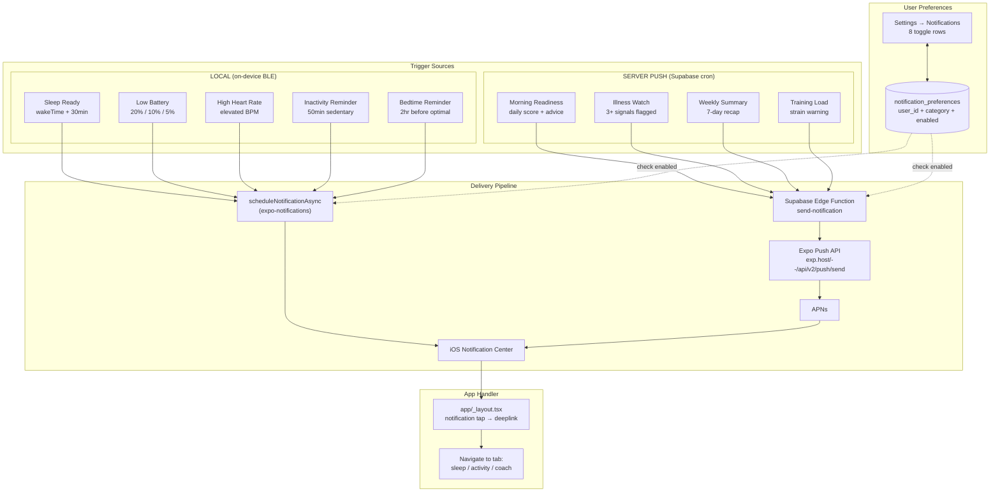

# Feature Plan: Comprehensive Notification System

## Overview
A full notification system for Focus — 8 notification categories across local (BLE-triggered) and server push (Supabase-triggered) channels, with per-category toggles in Settings. Inspired by Oura's conservative defaults and Ultrahuman's proactive insights.

## Architecture Diagram



## Notification Categories

### Category 1: Sleep Insights (Local)
| Field | Value |
|---|---|
| **Key** | `sleep_insights` |
| **Default** | ON |
| **Trigger** | Background fetch detects sleep endTime after 7 AM |
| **Timing** | wakeTime + 30 minutes |
| **Title** | "Your Sleep Analysis is Ready 🌙" |
| **Body** | "You slept {hours}h {min}m with a score of {score}. Tap to see your insights." |
| **Deeplink** | `smartring:///?tab=sleep` |
| **Source** | `BackgroundSleepTask.ts` (already implemented) |
| **Change needed** | Add dynamic sleep score/duration to body text, check preferences before sending |

### Category 2: Heart Rate Alerts (Local)
| Field | Value |
|---|---|
| **Key** | `heart_rate_alerts` |
| **Default** | ON |
| **Trigger** | Real-time HR exceeds resting HR baseline + 40 BPM (or absolute > 120 BPM at rest) |
| **Timing** | Immediate, 10-min debounce |
| **Title** | "Elevated Heart Rate ⚠️" |
| **Body** | "Your heart rate reached {bpm} BPM. Take a moment to rest and breathe." |
| **Deeplink** | `smartring:///?tab=overview` |
| **Source** | `JstyleBridge.m` `maybeSendHighHRAlert:` (already implemented) |
| **Change needed** | Check preferences via AsyncStorage mirror before sending |

### Category 3: Battery (Local)
| Field | Value |
|---|---|
| **Key** | `battery_alerts` |
| **Default** | ON |
| **Trigger** | Battery drops below 20%, 10%, 5% |
| **Timing** | Immediate, re-arms above 30% |
| **Title** | "Low Ring Battery 🔋" |
| **Body** | "Ring battery is at {level}%. {level <= 5 ? 'Charge now!' : 'Remember to charge soon.'}" |
| **Deeplink** | none |
| **Source** | `JstyleBridge.m` `maybeSendLowBatteryAlert:` (already implemented) |
| **Change needed** | Check preferences via AsyncStorage mirror |

### Category 4: Activity Reminders (Local) — NEW
| Field | Value |
|---|---|
| **Key** | `activity_reminders` |
| **Default** | OFF |
| **Trigger** | 50 minutes of continuous inactivity (no step count increase) during waking hours (8 AM – 9 PM) |
| **Timing** | At 50-min mark, then not again for 60 min after dismissal |
| **Title** | "Time to Move 🚶" |
| **Body** | "You've been still for a while. A quick walk or stretch can boost your focus." |
| **Deeplink** | `smartring:///?tab=activity` |
| **Source** | New — `BackgroundSleepTask.ts` can be extended or a new background task |
| **Implementation** | Track last step count in AsyncStorage; on background fetch, compare current steps to last check. If delta = 0 for 50+ min and within waking hours, fire notification. |

### Category 5: Bedtime Reminder (Local) — NEW
| Field | Value |
|---|---|
| **Key** | `bedtime_reminder` |
| **Default** | OFF |
| **Trigger** | 1 hour before target bedtime |
| **Timing** | Scheduled daily based on user's average bedtime from last 14 nights |
| **Title** | "Wind Down Soon 😴" |
| **Body** | "Your usual bedtime is around {time}. Start winding down for better sleep." |
| **Deeplink** | `smartring:///?tab=sleep` |
| **Source** | New — compute average bedtime from `sleep_sessions` in Supabase, schedule with `scheduleNotificationAsync` using a daily trigger |
| **Implementation** | On morning background fetch (after scheduling sleep ready), also compute avg bedtime from last 14 days and schedule bedtime reminder for that evening. |

### Category 6: Daily Insights (Server Push) — NEW
| Field | Value |
|---|---|
| **Key** | `daily_insights` |
| **Default** | ON |
| **Trigger** | Supabase cron (Edge Function) at 9 AM user local time |
| **Timing** | 9 AM daily (or after sleep data synced, whichever is later) |
| **Title** | Dynamic based on readiness score |
| **Body examples** | |
| Score 80+ | "Great recovery! Readiness {score}. You're primed for a strong day 💪" |
| Score 60-79 | "Moderate recovery ({score}). Listen to your body — a balanced day ahead." |
| Score < 60 | "Low readiness ({score}). Consider an easy day — your body needs recovery." |
| Illness WATCH | "Health check: {count} signals slightly off. Keep an eye on how you feel." |
| Illness SICK | "⚠️ Multiple health signals flagged. Consider resting today." |
| **Deeplink** | `smartring:///?tab=coach` (Focus/Readiness screen) |
| **Source** | New Supabase Edge Function `daily-insight-push` |
| **Implementation** | Edge function runs on cron, queries latest readiness data from Supabase for each user with `daily_insights` enabled, computes score server-side (or reads cached score), sends via Expo Push API. |

### Category 7: Training Load (Server Push) — NEW
| Field | Value |
|---|---|
| **Key** | `training_alerts` |
| **Default** | OFF |
| **Trigger** | Strava activity synced with high strain + low readiness |
| **Timing** | Within 30 min of Strava activity sync |
| **Title** | "Training Load Alert 🏃" |
| **Body** | "Your {activity_type} today pushed your 7-day training load to {load}. Recovery is important — consider an easy day tomorrow." |
| **Deeplink** | `smartring:///?tab=activity` |
| **Source** | New — Supabase DB trigger on `strava_activities` INSERT → calls Edge Function |
| **Implementation** | Postgres trigger on strava_activities insert → pg_net call to Edge Function → compute 7-day training load → if above threshold AND readiness < 70, send push. |

### Category 8: Weekly Summary (Server Push) — NEW
| Field | Value |
|---|---|
| **Key** | `weekly_summary` |
| **Default** | ON |
| **Trigger** | Supabase cron every Monday at 10 AM |
| **Timing** | Monday 10 AM |
| **Title** | "Your Week in Focus 📊" |
| **Body** | "Last week: avg sleep {hrs}h, avg readiness {score}, {steps}k steps. Tap to see your full report." |
| **Deeplink** | `smartring:///?tab=overview` |
| **Source** | New Supabase Edge Function `weekly-summary-push` |
| **Implementation** | Edge function queries `weekly_summaries` or aggregates from daily tables, formats summary, sends via Expo Push API. |

## Data Source
- **Local notifications:** X3 SDK via BLE (sleep, HR, battery, steps)
- **Server push:** Supabase tables (`sleep_sessions`, `hrv_readings`, `steps_readings`, `strava_activities`, `daily_summaries`)
- **Preferences:** New `notification_preferences` table in Supabase + AsyncStorage mirror for native-side checks

## Implementation Steps

### 1. Database

**Migration:** `supabase/migrations/20260322_notification_preferences.sql`

```sql
CREATE TABLE notification_preferences (
  id UUID PRIMARY KEY DEFAULT gen_random_uuid(),
  user_id UUID NOT NULL REFERENCES auth.users(id) ON DELETE CASCADE,
  category TEXT NOT NULL,
  enabled BOOLEAN NOT NULL DEFAULT true,
  created_at TIMESTAMPTZ DEFAULT now(),
  updated_at TIMESTAMPTZ DEFAULT now(),
  UNIQUE(user_id, category)
);

ALTER TABLE notification_preferences ENABLE ROW LEVEL SECURITY;

CREATE POLICY "Users manage own prefs" ON notification_preferences
  FOR ALL TO authenticated USING (auth.uid() = user_id)
  WITH CHECK (auth.uid() = user_id);

-- Seed defaults on first access via the app (not here)
```

**Categories & defaults:**
| category | default enabled |
|---|---|
| `sleep_insights` | true |
| `heart_rate_alerts` | true |
| `battery_alerts` | true |
| `activity_reminders` | false |
| `bedtime_reminder` | false |
| `daily_insights` | true |
| `training_alerts` | false |
| `weekly_summary` | true |

### 2. Types

**File:** `src/types/notification.types.ts`

```typescript
export type NotificationCategory =
  | 'sleep_insights'
  | 'heart_rate_alerts'
  | 'battery_alerts'
  | 'activity_reminders'
  | 'bedtime_reminder'
  | 'daily_insights'
  | 'training_alerts'
  | 'weekly_summary';

export interface NotificationPreference {
  category: NotificationCategory;
  enabled: boolean;
}

export const NOTIFICATION_DEFAULTS: Record<NotificationCategory, boolean> = {
  sleep_insights: true,
  heart_rate_alerts: true,
  battery_alerts: true,
  activity_reminders: false,
  bedtime_reminder: false,
  daily_insights: true,
  training_alerts: false,
  weekly_summary: true,
};

export const NOTIFICATION_META: Record<NotificationCategory, {
  icon: string;
  title: string;
  description: string;
}> = {
  sleep_insights: {
    icon: '🌙',
    title: 'Sleep Insights',
    description: 'Morning notification with your sleep analysis',
  },
  heart_rate_alerts: {
    icon: '❤️',
    title: 'Heart Rate Alerts',
    description: 'Warnings when your heart rate is unusually high',
  },
  battery_alerts: {
    icon: '🔋',
    title: 'Battery Alerts',
    description: 'Low battery warnings at 20%, 10%, and 5%',
  },
  activity_reminders: {
    icon: '🚶',
    title: 'Activity Reminders',
    description: 'Nudge to move after 50 minutes of inactivity',
  },
  bedtime_reminder: {
    icon: '😴',
    title: 'Bedtime Reminder',
    description: 'Wind-down reminder 1 hour before your usual bedtime',
  },
  daily_insights: {
    icon: '💡',
    title: 'Daily Readiness',
    description: 'Morning readiness score and recommendation',
  },
  training_alerts: {
    icon: '🏃',
    title: 'Training Load',
    description: 'Alerts when your training load is high with low recovery',
  },
  weekly_summary: {
    icon: '📊',
    title: 'Weekly Summary',
    description: 'Monday recap of your sleep, activity, and readiness',
  },
};
```

### 3. Service Layer

**File:** `src/services/NotificationPreferencesService.ts`

```typescript
// Key methods:
async function loadPreferences(userId: string): Promise<NotificationPreference[]>
async function setPreference(userId: string, category: NotificationCategory, enabled: boolean): Promise<void>
async function isEnabled(category: NotificationCategory): Promise<boolean>
  // Reads from AsyncStorage mirror first (fast, works offline + native side)
  // Falls back to Supabase
async function syncToAsyncStorage(prefs: NotificationPreference[]): Promise<void>
  // Mirrors prefs to AsyncStorage for native-side access (JstyleBridge)
```

### 4. Hook

**File:** `src/hooks/useNotificationPreferences.ts`

```typescript
function useNotificationPreferences(): {
  preferences: NotificationPreference[];
  loading: boolean;
  toggle: (category: NotificationCategory, enabled: boolean) => Promise<void>;
}
```
- Loads from Supabase on mount
- Syncs to AsyncStorage on every change
- Optimistic UI updates

### 5. UI Components

**File:** `src/screens/NotificationSettingsScreen.tsx` (new)

- Glass card with 8 rows
- Each row: emoji icon | title + description | Switch toggle
- Grouped into sections:
  - **Ring Alerts** — Sleep Insights, Heart Rate, Battery
  - **Reminders** — Activity, Bedtime
  - **Insights** — Daily Readiness, Training Load, Weekly Summary
- Follow SettingsScreen.tsx glass card pattern

**File:** `app/(tabs)/settings/notifications.tsx` (new route)

### 6. Integration

**SettingsScreen.tsx** — Add "Notifications" row in Preferences section → navigates to `/(tabs)/settings/notifications`

**BackgroundSleepTask.ts** — Check `isEnabled('sleep_insights')` before scheduling

**JstyleBridge.m** — Read AsyncStorage key `@focus_notif_prefs` before sending battery/HR alerts

**Future Edge Functions:**
- `supabase/functions/daily-insight-push/index.ts` — cron at 9 AM, queries readiness data, sends push
- `supabase/functions/weekly-summary-push/index.ts` — cron Monday 10 AM, aggregates weekly data, sends push

## Implementation Priority

### Phase 1 (Now) — Preferences + Gate existing notifications
- [ ] `notification_preferences` migration
- [ ] `src/types/notification.types.ts`
- [ ] `src/services/NotificationPreferencesService.ts`
- [ ] `src/hooks/useNotificationPreferences.ts`
- [ ] `src/screens/NotificationSettingsScreen.tsx`
- [ ] `app/(tabs)/settings/notifications.tsx`
- [ ] Gate `BackgroundSleepTask.ts` with preference check
- [ ] Gate `JstyleBridge.m` alerts with AsyncStorage preference check
- [ ] Add "Notifications" row to `SettingsScreen.tsx`

### Phase 2 — New local notifications
- [ ] Bedtime Reminder (compute avg bedtime, schedule daily)
- [ ] Inactivity Reminder (step delta tracking in background)

### Phase 3 — Server push notifications
- [ ] `supabase/functions/daily-insight-push/index.ts` — morning readiness push
- [ ] `supabase/functions/weekly-summary-push/index.ts` — Monday summary
- [ ] Strava training load trigger (DB trigger → Edge Function)
- [ ] Illness Watch alerts (server-side check)

## Files to Create
- [ ] `supabase/migrations/20260322_notification_preferences.sql`
- [ ] `src/types/notification.types.ts`
- [ ] `src/services/NotificationPreferencesService.ts`
- [ ] `src/hooks/useNotificationPreferences.ts`
- [ ] `src/screens/NotificationSettingsScreen.tsx`
- [ ] `app/(tabs)/settings/notifications.tsx`
- [ ] `supabase/functions/daily-insight-push/index.ts` (Phase 3)
- [ ] `supabase/functions/weekly-summary-push/index.ts` (Phase 3)

## Files to Modify
- [ ] `src/services/BackgroundSleepTask.ts` — check preferences before scheduling
- [ ] `ios/JstyleBridge/JstyleBridge.m` — read AsyncStorage prefs before battery/HR alerts
- [ ] `src/screens/SettingsScreen.tsx` — add Notifications row
- [ ] `app/(tabs)/settings/_layout.tsx` — register notifications route
- [ ] `src/i18n/locales/en.json` + `es.json` — notification preference labels

## Open Questions
1. **Inactivity detection:** Should we use accelerometer data from the ring (if available via X3 SDK) or step count delta? Step count is simpler but less real-time.
2. **Bedtime computation:** Use average of last 14 nights, or let the user set a fixed target bedtime?
3. **Daily insights timing:** Fixed 9 AM, or dynamic based on detected wake time + 1 hour?
4. **Weekly summary day:** Monday, or user-configurable?
